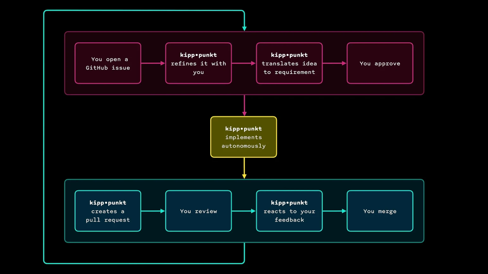

# @kipppunkt/agent

> From **Kipppunkt** (German: *tipping point*).

kipp•punkt is an **AI coding agent orchestrator** that helps you shape your ideas. Implements. Opens PRs. Responds to reviews. Fully autonomous.

You decide what gets built and what gets merged. 

From anywhere 🏝️

**[Start in 5 minutes](https://kipppunkt.dev/get-started/prerequisites/)** · [See kipp•punkt in action](https://github.com/kipppunkt/website/pulls?q=is%3Apr+author%3Akipppunkt-agent+is%3Aclosed)

## How kipp•punkt works



- **Meets you where you are.** Integrates into GitHub Issues and PRs. No new UI, no new workflow.
- **Async.** Review and approve from anywhere, even your phone.
- **Concurrent.** Run multiple agents on different tasks in parallel.
- **Model-agnostic.** Works with Claude Code, Codex, OpenCode, and many more.
- **Self-hosted.** Runs 100% local on your machine.

## Quick links

- **[Quick start guide](https://kipppunkt.dev/get-started/prerequisites/)** - Get running in 5 minutes
- **[Installation](https://kipppunkt.dev/reference/installation/)** - npm, global install, and direct download
- **[CLI commands](https://kipppunkt.dev/reference/cli-commands/)** - Complete command reference
- **[Configuration](https://kipppunkt.dev/reference/configuration/)** - Concurrency, polling, allowlist, and more
- **[Roadmap](https://kipppunkt.dev/concepts/roadmap/)** - What's coming next

## Quick start

**Prerequisites:** an AI coding agent ([Codex](https://github.com/openai/codex), [Claude Code](https://github.com/anthropics/claude-code), or similar), the [GitHub CLI](https://cli.github.com/), and a separate bot GitHub account with a personal access token (`repo` scope). See the **[full prerequisites guide](https://kipppunkt.dev/get-started/prerequisites/)** for details.

1. **Set your bot token:**

   ```bash
   export GH_TOKEN=ghp_your_bot_token_here
   ```

2. **Start the orchestrator** from the root of your repository:

   ```bash
   npx @kipppunkt/agent start \
     --command "codex exec {prompt} --dangerously-bypass-approvals-and-sandbox"
   ```

   Other harnesses work too. See [CLI commands](https://kipppunkt.dev/reference/cli-commands/) for Claude Code, OpenCode, and Copilot CLI templates.

3. **Open a GitHub issue.** Describe what you want to build and assign it to the bot account. See [Ship your first idea](https://kipppunkt.dev/get-started/ship-your-first-idea/) for a full walkthrough.

## Documentation

**[kipppunkt.dev](https://kipppunkt.dev)**